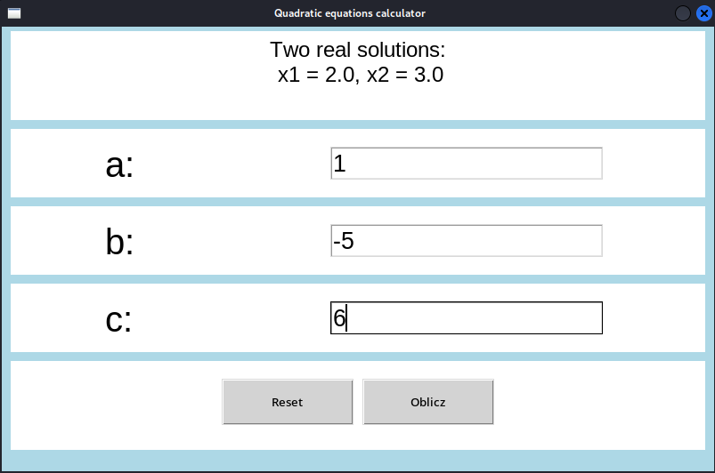
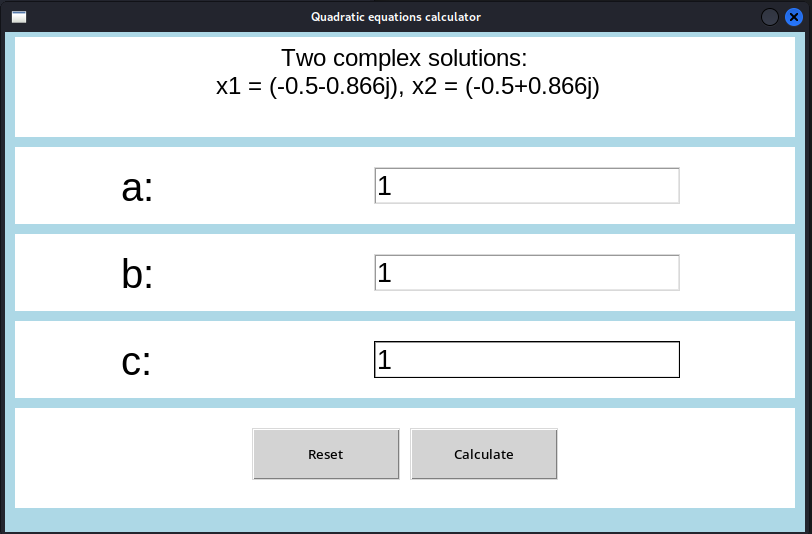
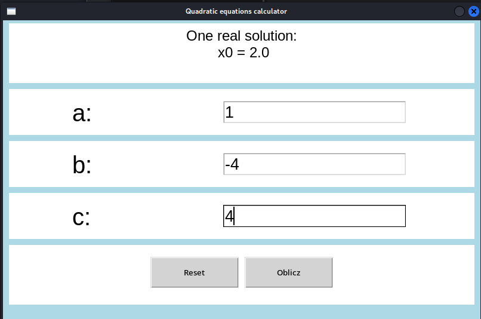
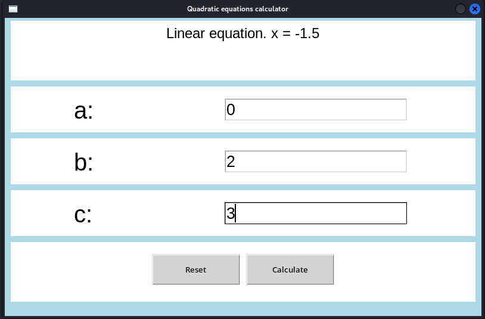

# tkinter-quadratic-calculator
Tkinter Quadratic Equation Calculator: A simple application for calculating the solutions of quadratic equations (ax² + bx + c) using Python's Tkinter library. It features a user-friendly interface, input validation, and can compute real and complex roots, making it ideal for students and anyone needing quick calculations.

# Tkinter Quadratic Equation Calculator

**Tkinter Quadratic Equation Calculator**: A simple application for calculating the solutions of quadratic equations (ax² + bx + c) using Python's Tkinter library. It features a user-friendly interface, input validation, and can compute real and complex roots, making it ideal for students and anyone needing quick calculations.

## Features
- **User-friendly GUI**: Designed with Tkinter for easy use.
- **Input Validation**: Ensures users enter valid numerical coefficients.
- **Real and Complex Roots**: Calculates both real and complex solutions.
- **Reset Functionality**: Quickly reset inputs and results.
# Screenshots

### Main Window


### Example with Two Real Roots


### Example with Complex Roots


### Example with One Root (Delta = 0)


### Input Validation Example


## Requirements
- **Python 3.12**: Ensure you have Python 3.12 installed.
- **Tkinter**: Typically included with Python installations.

## Adding the .exe File

To create an executable (.exe) file from the quadratic equation calculator application, the **PyInstaller** tool was used. The .exe file is now available in the `dist` folder.

The following steps were taken:
1. Installed **PyInstaller** (if not previously installed).
2. Used the command `pyinstaller --onefile quadratic_calculator.py` to generate the .exe file.
3. Updated the project structure by removing unnecessary build files and the .spec file.

The .exe file is accessible in the repository and can be run on Windows systems.

## Installation
1. Clone the repository:
   ```bash
   git clone https://github.com/szymon-tulodziecki/tkinter-quadratic-calculator.git
