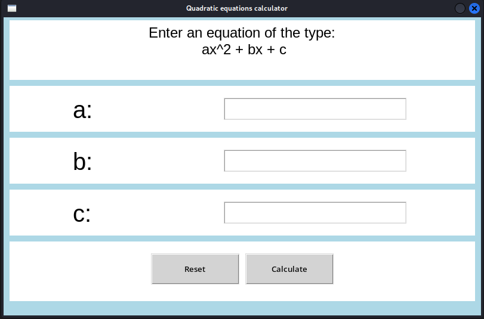
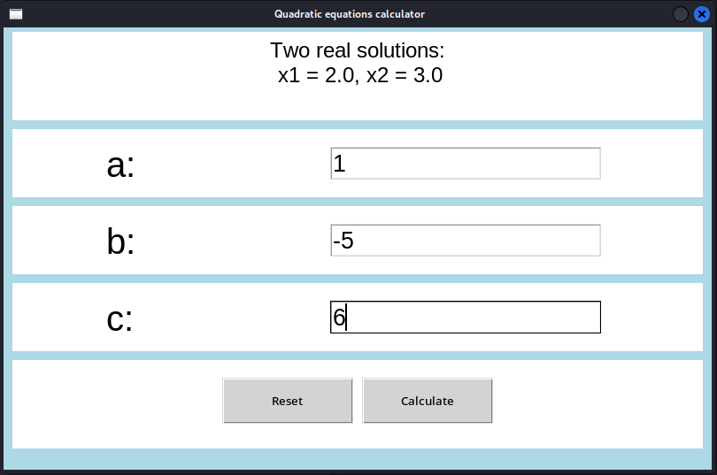
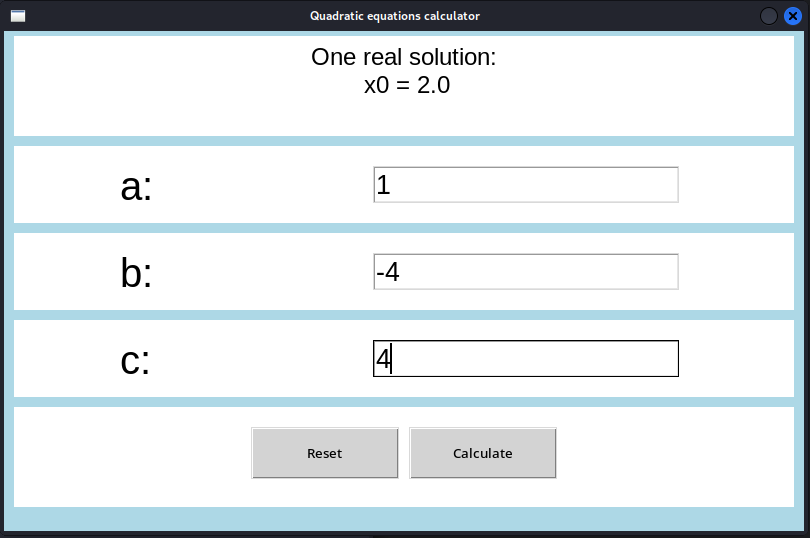

# tkinter-quadratic-calculator
Tkinter Quadratic Equation Calculator: A simple application for calculating the solutions of quadratic equations (ax² + bx + c) using Python's Tkinter library. It features a user-friendly interface, input validation, and can compute real and complex roots, making it ideal for students and anyone needing quick calculations.

# Tkinter Quadratic Equation Calculator

**Tkinter Quadratic Equation Calculator**: A simple application for calculating the solutions of quadratic equations (ax² + bx + c) using Python's Tkinter library. It features a user-friendly interface, input validation, and can compute real and complex roots, making it ideal for students and anyone needing quick calculations.

## Features
- **User-friendly GUI**: Designed with Tkinter for easy use.
- **Input Validation**: Ensures users enter valid numerical coefficients.
- **Real and Complex Roots**: Calculates both real and complex solutions.
- **Reset Functionality**: Quickly reset inputs and results.
# Screenshots

### Main Window


### Example with Two Real Roots


### Example with Complex Roots


### Example with One Root (Delta = 0)


### Input Validation Example


## Requirements
- **Python 3.12**: Ensure you have Python 3.12 installed.
- **Tkinter**: Typically included with Python installations.

## Installation
1. Clone the repository:
   ```bash
   git clone https://github.com/szymon-tulodziecki/tkinter-quadratic-calculator.git
